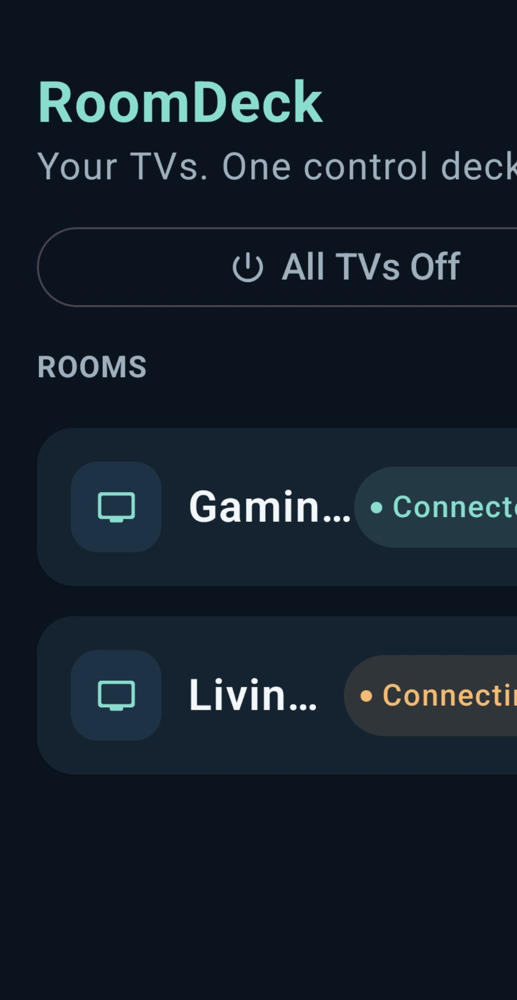
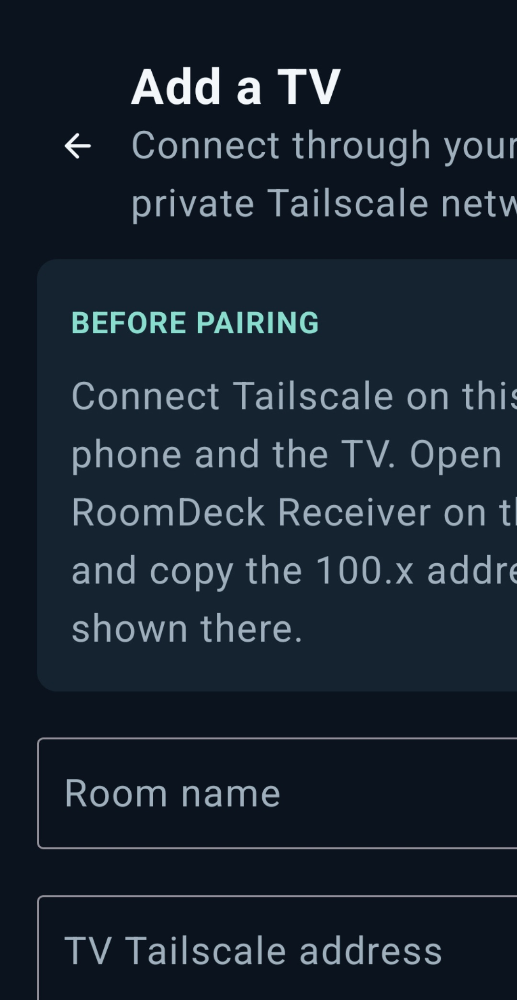
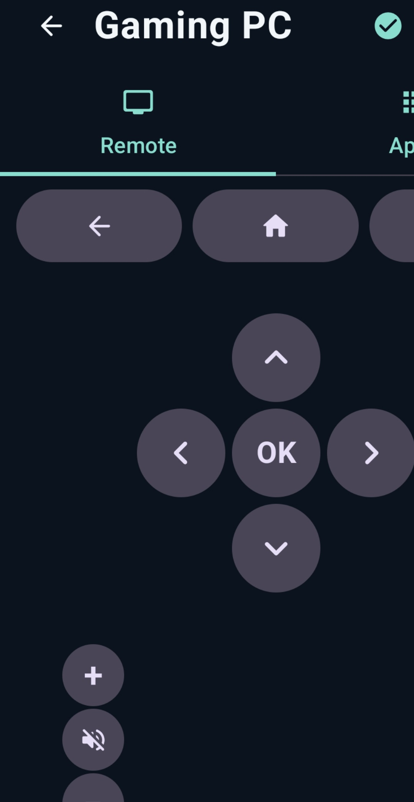
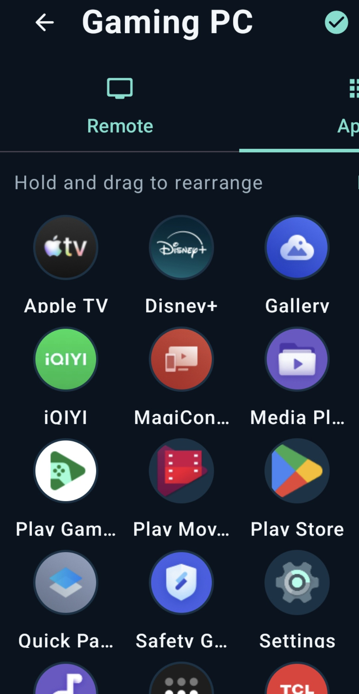

# RoomDeck


RoomDeck is a private, personal multi-TV remote for TCL Android TVs. One Controller app on the phone manages multiple TVs, while a lightweight Receiver on each TV supplies its installed-app catalog and secure launch routes over Tailscale.

## Preview

<table>
  <tr>
    <td align="center"><br><sub>Controller home</sub></td>
    <td align="center"><br><sub>Add a TV</sub></td>
  </tr>
  <tr>
    <td align="center"><br><sub>Remote deck</sub></td>
    <td align="center"><br><sub>TV apps</sub></td>
  </tr>
</table>

These privacy-safe captures show the V1 phone Controller during TCL Android TV testing.

## V1 features

- Save and switch between multiple TCL Android TVs.
- Use a compact portrait and landscape remote with Back, Home, Input, D-pad, volume, mute, channel, playback, and individual TV Off.
- Open and navigate the TV's own input chooser where the TV software supports the remote Input key.
- Browse each TV's launchable apps with progressively loaded icons.
- Open an app immediately and return to Remote for D-pad control.
- Hold and drag app tiles into a separate saved order for each TV.
- Send **All TVs Off**.

RoomDeck deliberately omits unreliable network power-on controls and its own USB browser. USB media stays inside the TV's Media Player app, preserving the player's normal browsing and subtitle support.

Compatibility note: the Input shortcut is model-specific on TCL software. If a TV does not respond to it, launch **Media Player** from the Apps tab instead.

## Architecture

- `mobile` — phone Controller (`io.github.tatselkrik.roomdeck`).
- `receiver` — Android TV Receiver (`io.github.tatselkrik.roomdeck.receiver`).
- `remote` — encrypted Android TV Remote v2 pairing and command channel.

Remote buttons use Android TV's encrypted remote-control protocol. Receiver reports launchable-app metadata first, then icons independently in small batches. Selected apps use one-time foreground launch routes, so listing or icon failures do not block ordinary remote controls.

RoomDeck requires Tailscale on the phone and every TV. It has no LAN fallback, cloud relay, RoomDeck account, analytics, advertising, or telemetry.

## Install

1. Download both APKs from the private `v1.0.0` GitHub release.
2. Install **RoomDeck Receiver** on each TV and **RoomDeck Controller** on the phone.
3. Connect Tailscale on the phone and TVs to the same tailnet, with incoming connections enabled on each TV.
4. Open Receiver once on each TV and note its private Tailscale address.
5. In Controller, choose **Add TV**, enter a room name and the displayed address, then enter the Android TV Remote pairing code shown on the TV.

Receiver authorization completes through the successful Android TV Remote pairing; there is no second RoomDeck code.

## Build locally

Use a current Android Studio installation with its bundled JDK. The project compiles against Android API 36.

```powershell
.\gradlew.bat testDebugUnitTest lintDebug assembleDebug --no-daemon
```

Generated APKs are under `mobile/build/outputs/apk/debug/` and `receiver/build/outputs/apk/debug/`.

## Release status

`v1.0.0` promotes the behavior tested as Controller test.18 and Receiver test.10. Automated tests, lint, assembly, APK metadata, signatures, and checksums are release gates. Android TV 14 behavior has been exercised on the primary TCL; the Android TV 12 and full cross-TV checklist remains the final compatibility record in [`docs/TV_TEST_CHECKLIST.md`](docs/TV_TEST_CHECKLIST.md).

See [`PRIVACY.md`](PRIVACY.md), [`SECURITY.md`](SECURITY.md), and the [`v1.0.0` release notes](docs/RELEASE_NOTES_v1.0.0.md).

## License and attribution

RoomDeck is licensed under Apache License 2.0. Parts of its Android TV Remote v2 implementation are adapted from [ScreenCast](https://github.com/ddagunts/ScreenCast) by Dmitry Dagunts. See [`NOTICE`](NOTICE) and [`THIRD_PARTY_NOTICES.md`](THIRD_PARTY_NOTICES.md).
